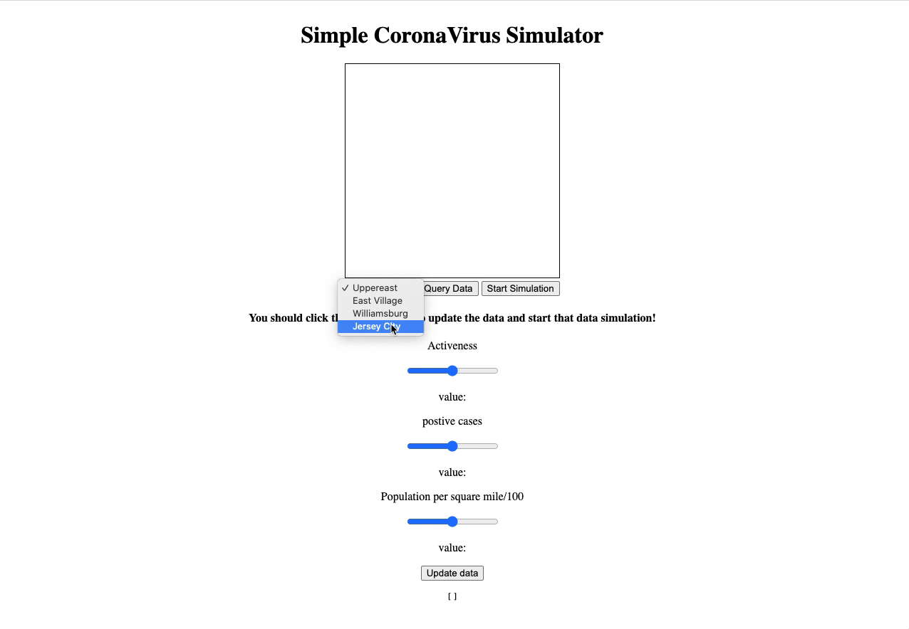

# Simple simulation for CoronaVirus

<!-- ABOUT THE PROJECT -->

## About The Project

This is a simple Corona Virus Simulator. To run a simulation, you first have to choose an area you want to simulate. Then you should click 'Query Data' which will read the data from the Firebase. When you click 'Start simulation', it will visualize how people become infected corona virus and who will be recovered from it.

You can also update your local information. For example, If positive cases, total population grows or activeness in the specific area have changed, you can update the current data to the most up-to-date version. Don't forget to click 'update data' in the bottom after you change the value with the slider. Then, it will show you a new simulation by clicking 'start simulation'.

For version 2, I will add up more measures and graph.

My code is based on youtube videos regarding collision detection, especially the gravity and collision dectection code. Here is the link -> <a href="https://www.youtube.com/watch?v=XYzA_kPWyJ8&t=567s">collision detection — Part 1-2.</a>

 

### Built With

- [HTML]
- [CSS]
- [JAVASCRIPT]
- [VUE]
- [FIREBASE]

<!-- LICENSE -->

## License

Distributed under the MIT License. See `LICENSE` for more information.
